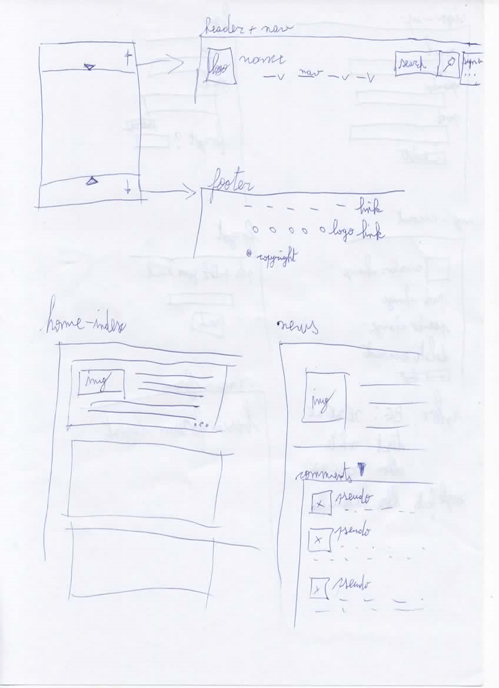
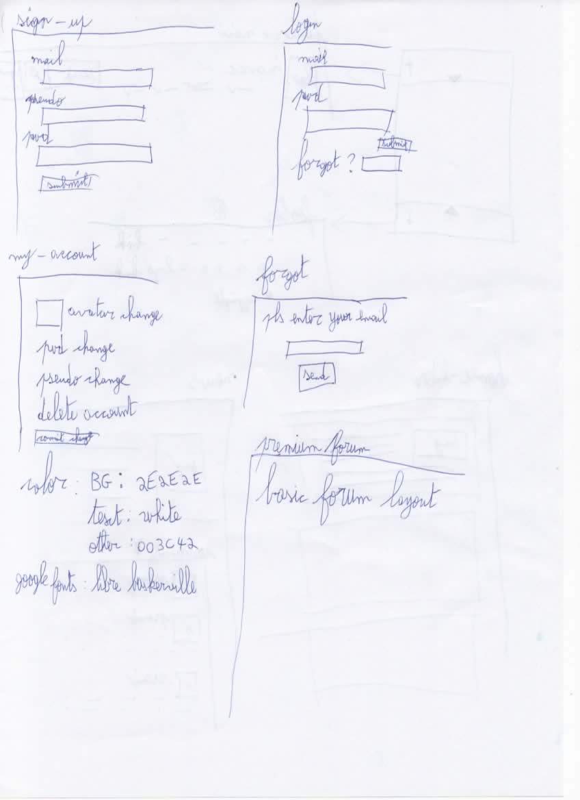

# npProject


## About / Synopsis

* This is a consolidation challenge for Becode to prove your knowledge of OOP with Node.JS or PHP
* source : [Here](https://github.com/becodeorg/BXL-Swartz-3-21/tree/master/09-OOP-npProject)
* Theme : News site
* Project status: sketch done, beginning front-end

## Table of contents

> * [Title / Repository Name](#npProject)
>   * [About / Synopsis](#about--synopsis)
>   * [Table of contents](#table-of-contents)
>   * [Installation](#installation)
>   * [Usage](#usage)  
>     * [Mock-up](#mock-up)  
>     * [Screenshots](#screenshots)
>     * [Features](#features)
>   * [Code](#code)
>     * [Content](#content)
>     * [Requirements](#requirements)
>     * [Limitations](#limitations)
>     * [Build](#build)
>     * [Deploy (how to install build product)](#deploy-how-to-install-build-product)
>   * [Resources (Documentation and other links)](#resources-documentation-and-other-links)
>   * [Contributing / Reporting issues](#contributing--reporting-issues)
>   * [License](#license)
>   * [About Becode](#about-Becode)

## Installation

Install Node.JS
Update and download the dependencies with ```npm install```
Then run ```nodemon app``` or ```node app``` if you don't use nodemon

## Usage

N/A
### Mock-up




### Screenshots


### Features

+ Git Workflow
+ Factorised code
+ MVC Structure
+ Authentification system (register, log in, log out, jwt cookie)
+ Protected routes
+ Conditionnal rendering
+ Newsletter inscription list

## Code

### Content

The challenge is to do everything from front to back.

### Requirements

Node.JS for dependencies check package.json

### Limitations

None for the front-end.
No framework for back-end if coded in PHP, basic framework for Node.

### Build

v0 for now

### Deploy (how to install build product)

N/A

## Resources (Documentation and other links)

To do

## Contributing / Reporting issues

None for now

## License

+ Becode
+ Open Font License

## About Becode

>"Learn to code, find a job"

BeCode’s mission : Enabling tomorrow’s digital talents to blossom.

We believe that education makes anything possible.

Since 2017, BeCode has been offering inclusive coding bootcamps for jobseekers to become developers in partnership with Simplon.

More information is available at [Becode](https://becode.org/).